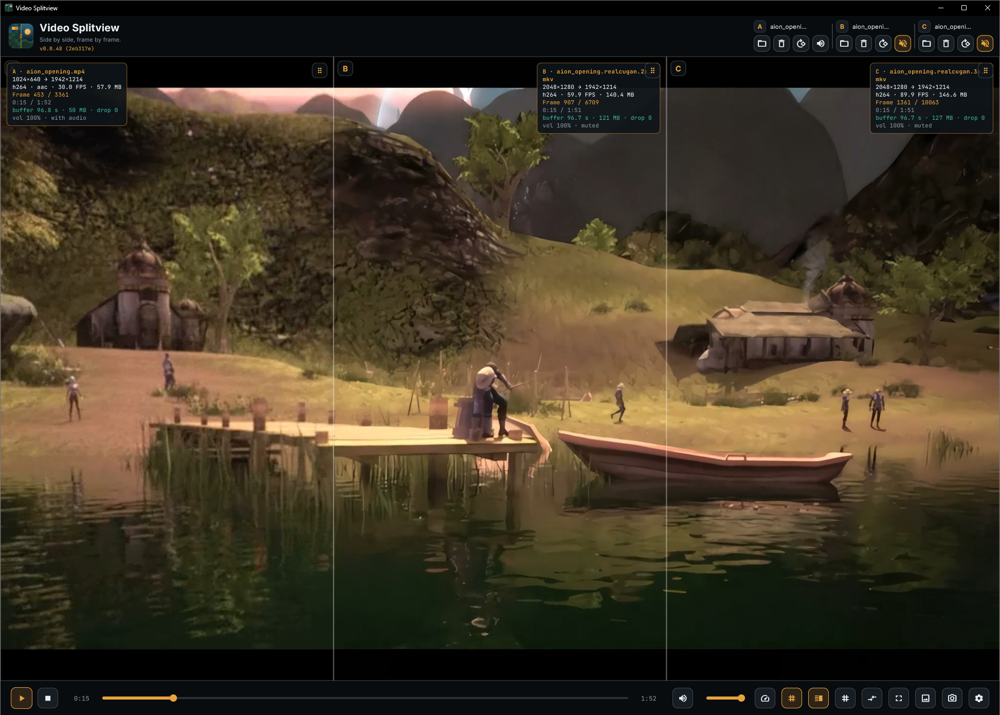
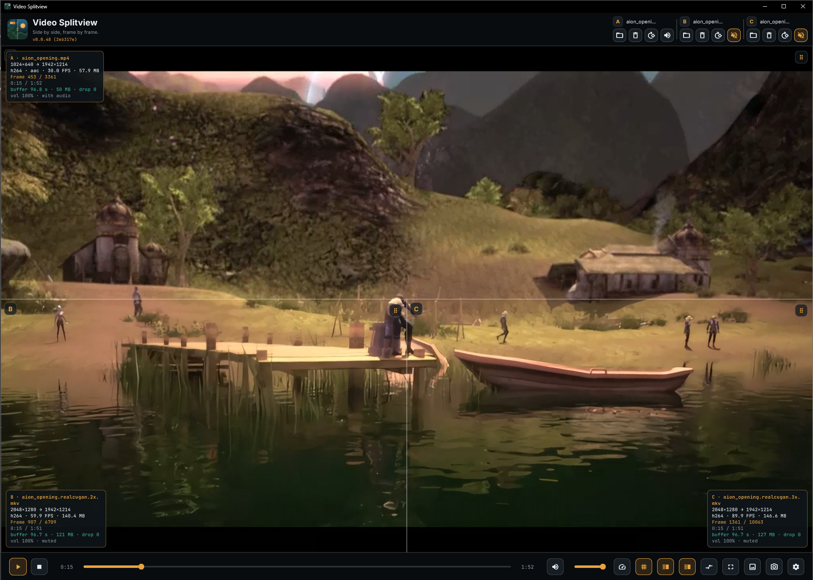
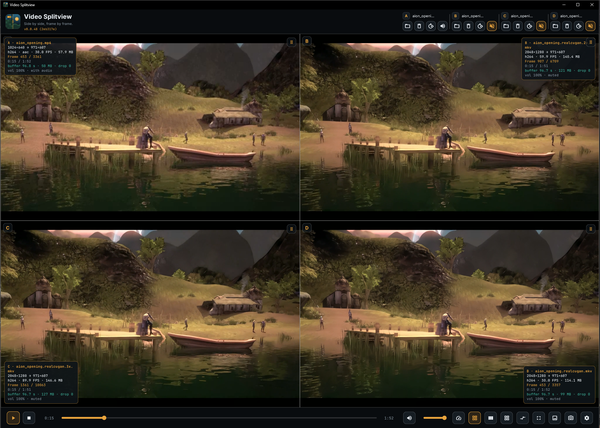
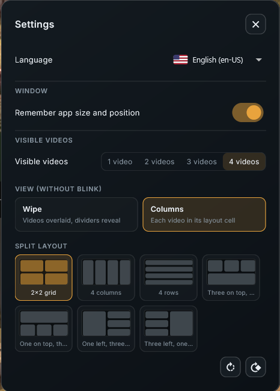

# Video Splitview

**Side by side, frame by frame.**


Desktop video comparison for Windows and Linux, **100% Flutter**, powered by the
**libmpv** engine (via [`media_kit`](https://pub.dev/packages/media_kit)). The UI
and every video are composed in the same Flutter scene, with no overlapping native
layers.

## Screenshots

| | |
| --- | --- |
| **Three videos · side by side** | **Three videos · two on top, one below** |
|  |  |
| **Four videos · one view** | **Settings** |
|  |  |


## Highlights

- Compare **1 to 4 videos** at once, each in its own layout cell.
- **Drag & drop** files onto a panel or click to open (multi-select supported).
- **Wipe** (overlaid, dividers reveal), **Columns** (each video in its cell) and
**Blink** (alternate A↔B).
- Frame-accurate sync with drift correction, frame stepping and jog.
- Rich on-video HUD: FPS, frame, buffer, desync (Δ ms) and full per-video statistics.
- Save/copy the comparison as a PNG.


## Features


### Videos and layout

- **1, 2, 3 or 4 videos** in a single view. The top bar switches to a compact
layout for 3–4 videos so all side groups fit.
- **Open / change / remove** per side, plus **rotate** (rotate that video 90°) and
**mute**.
- **Drag & drop**: drop one or more files onto a panel. With multiple files, the
view count is adjusted to `min(n, 4)` and the files are assigned to the active
sides in order.
- **Split layouts** (independent of the view mode):
  - 2 videos: side by side, stacked.
  - 3 videos: 3 columns, 3 rows, two on top + one below, one on top + two below,
  one left + two right, two left + one right.
  - 4 videos: 2×2 grid, 4 columns, 4 rows, three on top + one below, one on top +
  three below, one left + three right, three left + one right.
- **Rotate positions** (reshuffle which video sits in which cell) and **rotate all
videos** 90°.


### View modes

- **Wipe** — videos are overlaid; the divider reveals one over the other.
- **Columns** — each video is drawn in its layout cell.
- **Blink** — toggles A↔B on a timer (100–1000 ms), ignoring the split, with a
large A/B letter. The letter position is configurable: top, middle or bottom.


### Playback and sync

- Aligned start and **exact seek** on every side; the frame-step leader is the
highest-FPS side.
- **Drift correction** with hysteresis (≈30 ms deadband, ±3%, ≈700 ms settle) and a
manual **resync**.
- **Frame stepping** with the arrow keys; the step size is configurable (1, 2 or 5
frames).
- **Hold to jog**: keep an arrow key pressed — forward plays a continuous jog,
backward repeats exact frame steps. The hold speed is configurable (10–100%).
- **`Shift`+arrows** nudge ±1 s, **`Ctrl`+arrows** nudge ±5 s (shown as a toast).
- **Playback speed** 0.25×–2.0× (slider; quick presets).
- **Per-side mute** and global mute. When two videos carry audio, one side is muted
automatically with a toast.
- **Buffer profile** (small 64 MB / normal 150 MB / large 512 MB) and a per-side
**buffer indicator**.
- A **"Syncing…"** spinner next to the splitter while a seek/decode settles.
- **Playback diagnostic modal** when a file fails to open: check the libmpv engine
and copy a full diagnostic report (date, side, file, path, error code, engine
found/bundled/path/version/state), or pick another file.


### Overlays (HUD)

- **FPS** and **frame** per side while stepping (or always, via setting).
- **Buffer** indicator and **drift meter** (Δ A↔B in ms).
- **Full per-video statistics** overlay (file, resolution/codec/FPS, frame, time,
buffer, volume/audio), which replaces the FPS/buffer pills.
- Overlay position is configurable independently on the **vertical axis**
(top / center / bottom / corner) and **horizontal axis** (left / center / right /
corner).


### Performance / quality

- **Video scaling**: Bilinear (lightest), Bicubic (balanced), Lanczos (best).
- **Video sync**: Audio (default), Display resample (smooth), Desync (less GPU).
- **Hardware decoding**: Off (software), Compatible (auto-copy), Direct (maps to
auto-copy on Windows — see [`docs/ARCHITECTURE.md`](docs/ARCHITECTURE.md)).
- **Drop late frames** (`framedrop`) and **motion interpolation**.


### Capture

- **Copy comparison image** to the clipboard (PNG).
- **Save comparison** as a PNG file. The image is composed in Dart from each side's
screenshot, following the current layout and spans (platform video textures cannot
be captured with a `RepaintBoundary`).


### Window, language and updates

- **Remember app size and position** (portable, stored next to the executable).
- **Fullscreen** with `F`/`F11`; `Esc` exits fullscreen or closes the open modal.
- **Reactive i18n**: Português (pt-BR), English (en-US), Español (es-ES) — switching
is instant and applies to the whole app.
- **Update check**: queries the latest GitHub Release in the background on startup.
Settings shows the current version, the status, a **Check for updates** button,
and — when an update exists — a **Download update** link. The settings button also
shows a small badge. Nothing is downloaded or installed automatically; it only
informs and opens the release page.
- Instant tooltips and a custom dark theme (Inter + JetBrains Mono, bundled).


### Supported formats

The file dialog filters the common `mp4, m4v, webm, mkv, mov, avi, ogv, ogg, ts, mts, m2ts, 3gp, 3g2, flv, wmv, asf, mpg, mpeg, m2v, vob, mxf, rm, rmvb, divx, f4v`
extensions, plus **All files**. Decoding is handled by libmpv, which brings its own
codecs — installing system codecs does not change what the app can play.

### Shortcuts


| Key                           | Action                                             |
| ----------------------------- | -------------------------------------------------- |
| `Space`                       | Play / pause                                       |
| `←` / `→`                     | Step 1 frame (hold to jog forward / step backward) |
| `Shift` + `←` / `→`           | Nudge ±1 s                                         |
| `Ctrl` (or `Cmd`) + `←` / `→` | Nudge ±5 s                                         |
| `M`                           | Mute                                               |
| `F` / `F11`                   | Fullscreen                                         |
| `Esc`                         | Close modal / exit fullscreen                      |


## Clone and build locally


### Prerequisites you must install manually

The build scripts handle versioning, packaging and (on Linux) the whole toolchain,
but a few things can only be installed by you:

**Windows (required to build/run the Windows app):**

1. **Flutter SDK** (stable channel) with Windows desktop enabled.
  Add `flutter\bin` to your `PATH`, then:
  ```powershell
  flutter config --enable-windows-desktop
  ```
2. **Visual Studio 2022** with the **Desktop development with C++** workload
  (this provides the MSVC toolchain and the Windows SDK).
3. **Windows Developer Mode** enabled — the plugins use symlinks:
  ```powershell
   start ms-settings:developers
  ```
4. **Git**.
5. Windows 10/11 (x64 or arm64).

Verify everything with:

```powershell
flutter doctor -v
```

`flutter doctor` must report the Windows toolchain as OK before you build.

**Optional — Windows installer:** the `.exe` installer needs **Inno Setup 6/7**.
Without it, `tool/package.ps1` still builds the portable ZIP and just warns:

```powershell
winget install --id JRSoftware.InnoSetup -e
```

**Linux (WSL2, container or native Linux):**

1. **WSL2 with a distro installed** — if building Linux from Windows, install
  **Ubuntu-24.04** and/or **FedoraLinux-44** (`wsl --install -d Ubuntu-24.04`).
2. **`sudo` access** inside the distro (used to install build dependencies).
3. **Git**, **curl** and internet access.

Everything else on Linux (**clang, cmake, ninja, pkg-config, GTK3 dev, libmpv dev,
libepoxy, patchelf, dpkg-dev/rpm-build, the native Flutter SDK and appimagetool**)
is installed automatically by `tool/linux/setup_env.sh` the first time you build.

You do **not** need to install mpv, GStreamer or codecs: on Windows
`libmpv-2.dll` is bundled by `media_kit_libs_windows_video`, and on Linux the
installer depends on the system `libmpv` (the AppImage bundles it).

### Quick start (Windows)

```powershell
git clone https://github.com/giordanidev/video-splitview.git
cd video-splitview
flutter pub get

# dev with hot reload (r = reload, R = restart, q = quit) — no version bump
powershell -ExecutionPolicy Bypass -File tool/dev.ps1
# or directly:  flutter run -d windows
```


### Quick start (Linux)

Linux builds run **inside Linux**. There are two entry points depending on where you
are:


| Where you run             | Command                                                             |
| ------------------------- | ------------------------------------------------------------------- |
| On Windows, via WSL2      | `powershell -ExecutionPolicy Bypass -File tool/build_wsl_linux.ps1` |
| Inside Linux/WSL (native) | `bash tool/linux/build.sh`                                          |


```bash
# inside Ubuntu-24.04 / FedoraLinux-44 (WSL) or native Linux
bash tool/linux/build.sh                   # native installer for the distro
bash tool/linux/build.sh --with-appimage   # + portable AppImage
bash tool/linux/build.sh --skip-setup      # do not reinstall the toolchain
```

The first run provisions the distro (`tool/linux/setup_env.sh`): apt/dnf build
dependencies, a native Flutter SDK, and a cached `appimagetool`.

### Build & distribution

The version is beta (`0.0.x`) and bumps automatically on every build; it shows on the
top bar as `v0.0.x (commit)`.

#### Windows

```powershell
# release build (bump + flutter build)
powershell -ExecutionPolicy Bypass -File tool/build.ps1

# release build without a version bump (reuses the current pubspec version)
powershell -ExecutionPolicy Bypass -File tool/build.ps1 -NoBump

# full package: versioned installer + portable (with bump)
powershell -ExecutionPolicy Bypass -File tool/package.ps1

# full package without a version bump
powershell -ExecutionPolicy Bypass -File tool/package.ps1 -NoBump
```

The executable is written to
`build/windows/x64/runner/Release/video-splitview.exe`.

#### Linux

```powershell
# on Windows, using the WSL distros: .deb on Ubuntu, .rpm on Fedora, AppImage on Ubuntu
powershell -ExecutionPolicy Bypass -File tool/build_wsl_linux.ps1
powershell -ExecutionPolicy Bypass -File tool/build_wsl_linux.ps1 -NoBump
powershell -ExecutionPolicy Bypass -File tool/build_wsl_linux.ps1 -Distro Ubuntu-24.04
```


#### Artifacts

Artifacts go to `dist/`, named `video-splitview-v<ver>-<system>-<arch>`:


| Artifact                                          | Description                                                                                               |
| ------------------------------------------------- | --------------------------------------------------------------------------------------------------------- |
| `video-splitview-v<ver>-windows-x64-setup.exe`    | Windows installer (Inno Setup; requires `ISCC.exe`)                                                       |
| `video-splitview-v<ver>-windows-x64-portable.zip` | Self-contained Windows portable (exe + DLLs + data + `READ-ME.txt`)                                       |
| `video-splitview-v<ver>-ubuntu-x64.deb`           | Debian/Ubuntu installer (`sudo dpkg -i`); depends on `libgtk-3-0`, `libmpv2`, `libepoxy0`, `libglib2.0-0` |
| `video-splitview-v<ver>-fedora-x64.rpm`           | Fedora/RHEL installer (`sudo dnf install`); depends on `gtk3`, `mpv-libs`, `libepoxy`                     |
| `video-splitview-v<ver>-linux-x64.AppImage`       | Portable with libmpv + ffmpeg bundled; needs GTK3/X11 on the host                                         |


### Tests

```powershell
flutter test
```

- `test/layout_test.dart` — layout geometry (cells, spans, split percent, rotation).
- `test/widget_test.dart` — time formatting.


## Architecture

```
lib/
  main.dart              entry (window, media_kit, ProviderScope)
  frontend/              presentation layer
    app.dart             MaterialApp (theme + locale)
    theme/               design tokens + theme
    widgets/             topbar, stage, controls, modals, flags, tooltips
  backend/               domain logic (no UI dependencies)
    models/              types (Side a–d, SplitLayout, PlayerState, Settings, enums)
    services/            mpv_side, playback_bridge (sync), file picker, capture, update
    state/               Riverpod (providers, settings, window state, assist, update)
    i18n/                text catalog (pt-BR/en-US/es-ES)
    generated/           version.dart (generated by tool/bump_version.ps1)
tool/                    build/version/icon/packaging scripts
tool/linux/              Linux build/packaging scripts (run on Linux)
windows/                 native runner generated by Flutter
linux/                   native runner (GTK) generated by Flutter
assets/                  icon (svg + png) and OFL fonts (Inter, JetBrains Mono)
docs/                    documentation
```

The dependency rule is **frontend → backend** (the backend never imports UI).

## Tools (`tool/`)


| Script                      | Purpose                                                                                    |
| --------------------------- | ------------------------------------------------------------------------------------------ |
| `bump_version.ps1`          | Bumps `0.0.x` in `pubspec.yaml` and generates `lib/backend/generated/version.dart`         |
| `dev.ps1`                   | Dev with hot reload (no version bump)                                                      |
| `run.ps1`                   | Dev with an automatic version bump                                                         |
| `build.ps1`                 | Release build (with optional `-NoBump`)                                                    |
| `package.ps1`               | Versioned Windows installer + portable                                                     |
| `build_wsl_linux.ps1`       | Windows → WSL2: Linux builds across distros (`.deb` on Ubuntu, `.rpm` on Fedora, AppImage) |
| `linux/build.sh`            | **Native** Linux builder (runs inside Linux/WSL)                                           |
| `linux/setup_env.sh`        | Provisions the distro (apt/dnf deps + Flutter SDK + appimagetool)                          |
| `linux/package_deb.sh`      | Builds the `.deb`                                                                          |
| `linux/package_rpm.sh`      | Builds the `.rpm` (rpmbuild)                                                               |
| `linux/package_appimage.sh` | Builds the `.AppImage` (bundles libmpv + ffmpeg)                                           |
| `make_icon.ps1`             | Generates the multi-resolution `windows/runner/resources/app_icon.ico` from the SVG/PNG    |
| `installer.iss`             | Inno Setup script used by `package.ps1`                                                    |


## Documentation

- [`docs/ARCHITECTURE.md`](docs/ARCHITECTURE.md) — architecture, known limitations
(hardware decoding on Windows), layout engine, i18n, icon and packaging internals.

